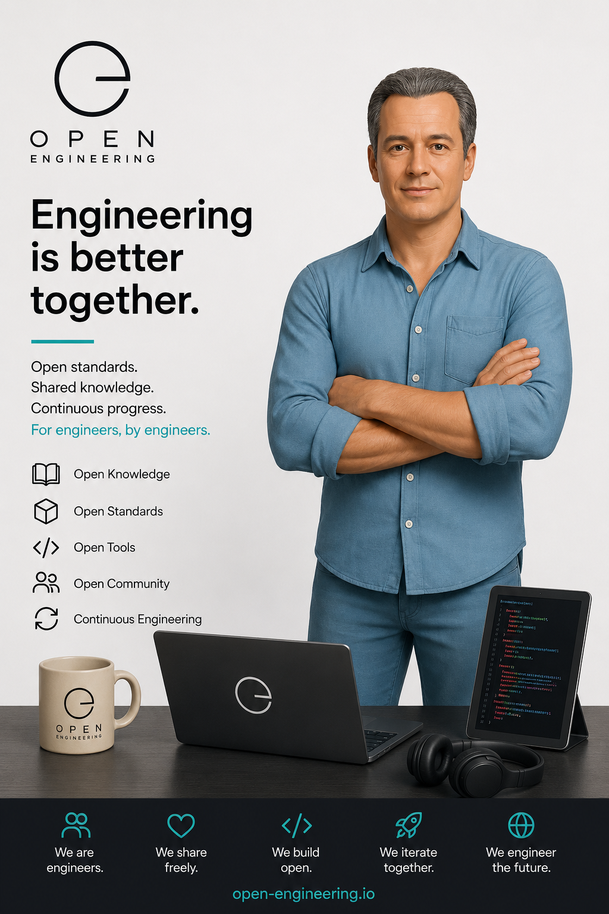

# Open Engineering

> Engineering should be open, composable, reusable, and enjoyable.

The **Open Engineering** is an open collection of platforms, products, conventions, ontologies, tools, intelligent assistants, and communities that together make engineering more understandable, more reusable, and more collaborative.

Rather than building isolated software projects, Open Engineering provides a shared ecosystem in which ideas, knowledge, software, games, investigations, and intelligent characters can evolve together.

Whether you are building software, investigating complex systems, teaching engineering concepts, creating interactive experiences, or experimenting with AI, Open Engineering provides a common foundation on which everything can grow.

---

# Our Vision

We believe engineering should become:

- **Open**, so knowledge can be shared.
- **Composable**, so solutions can be assembled instead of reinvented.
- **Understandable**, so complex systems become approachable.
- **Reusable**, so today's work becomes tomorrow's building block.
- **Collaborative**, where humans and AI improve each other.
- **Enjoyable**, because learning and engineering should be fun.

Open Engineering exists to make engineering ecosystems that continuously improve themselves.

---

# The Ecosystem

The ecosystem consists of many independent projects that share common principles while remaining free to evolve independently.

Examples include:

- [Open Engineering Continuity](https://github.com/open-engineering-continuity)
- Open Engineering Platform
- Open Engineering Ontology
- Open Engineering Conventions
- Open Engineering Brands
- Open Engineering Channels
- Open Engineering Infrastructure
- [Open Engineering Innovations](https://github.com/open-engineering-innovations)
- Open Engineering Signatures
- Detective Operating System
- Game Operating System
- Star Operating System
- Runner Operating System
- Code Smell Detectives
- Repository Detectives
- Agility Games
- PKIStars
- PixStars
- BlueFap

Every project contributes something unique while benefiting from the same shared architectural foundations.

---

# A Shared Foundation

The Open Engineering Platform provides the common technical foundation used throughout the ecosystem.

Rather than prescribing one technology stack or one programming language, it defines reusable concepts that allow projects to work together.

These include:

- a shared Kernel
- reusable Operating Systems
- reusable Capsules
- intelligent AI Assistants
- composable Applications
- a common Ontology
- a shared Product Model
- federated Systems of Record

Together they provide a consistent way of designing, implementing, operating, and evolving engineering systems.

---

# Four Architectural Dimensions

Open Engineering intentionally separates architecture into complementary dimensions.

Each answers a different engineering question.

| Dimension | Question |
|-----------|----------|
| **Ontology** | What exists? |
| **Product Model** | What should we build? |
| **Systems of Record** | What is true? |
| **Runtime Architecture** | How does it execute? |

Separating these concerns allows every part of the ecosystem to evolve independently without losing coherence.

---

# Engineering Through Stories

Open Engineering is more than software.

Knowledge is communicated through stories, characters, investigations, performances, and interactive experiences.

Examples include:

- detectives investigating software quality
- engineering games that teach architecture
- stage performances explaining AI
- interactive PKI demonstrations
- reusable learning journeys
- AI assistants that collaborate with engineers

Engineering becomes something people can explore rather than merely read about.

---

# Humans and AI

Open Engineering embraces AI as a collaborator.

AI assistants help:

- explain systems
- review designs
- generate documentation
- investigate software
- create learning experiences
- automate engineering tasks

The goal is not to replace engineers.

The goal is to help engineers create better engineering systems.

---

# Open by Design

Everything is designed around openness.

We encourage:

- open standards
- open documentation
- reusable conventions
- shared vocabularies
- composable architectures
- transparent governance
- community collaboration

Projects may evolve independently while remaining compatible through shared conventions.

---

# Explore the Ecosystem

The ecosystem is organised into complementary areas.

## Platform

The reusable technical foundation for engineering systems.

## Ontologies

Shared concepts and engineering vocabulary.

## Conventions

Standards for naming, documentation, APIs, repositories, networking, security, events, telemetry, and more.

## Brands

Visual identity and design systems.

## Channels

Websites, documentation portals, videos, presentations, and communication channels.

## Infrastructure

Hosting, deployment, cloud services, automation, and operational capabilities.

## Applications

Concrete implementations built on top of the platform, including engineering investigations, games, demonstrations, intelligent assistants, and learning experiences.

---

# Guiding Principles

Everything within Open Engineering strives to be:

- Open
- Modular
- Composable
- Explainable
- Reusable
- Observable
- Evolvable
- Collaborative
- Educational
- Fun

---

# Join the Journey

Open Engineering is an evolving ecosystem.

Whether you are:

- a software engineer
- an architect
- a product engineer
- a DevOps engineer
- a security specialist
- an educator
- a student
- a researcher
- a designer
- an AI enthusiast

there is a place for you to contribute.

Together we can build engineering systems that are not only powerful, but also understandable, reusable, and open.

---

# Learn More

Explore the Open Engineering ecosystem, discover its projects, contribute your ideas, and help shape the future of open engineering.
